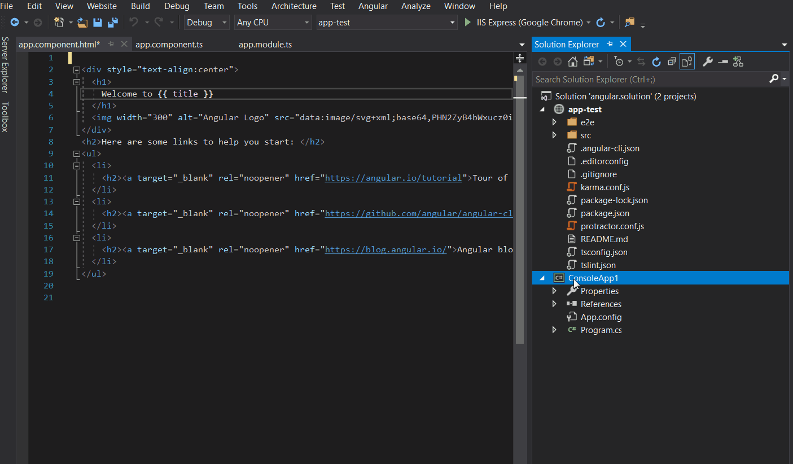
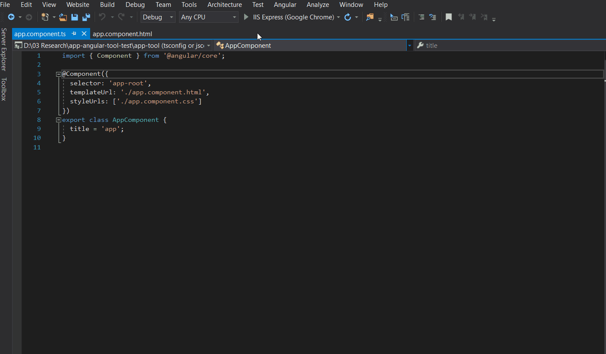

# Angular Html TS Switcher

Download this extension from the [Marketplace](https://visualstudiogallery.msdn.microsoft.com/[GuidFromGallery])
or from VS Gallery to get the [RC Version](http://vsixgallery.com/extension/593771d0-13b5-4de6-a192-165dd6f16144/).

---------------------------------------

Easily navigate between typescript(.ts) and template(.html) in angular project and ng serve angular project.

See the [change log](CHANGELOG.md) for changes and road map.

## Supported Visual Studio Versions 
- 2019 supported 
- 2017 In progress 

## Features

- Switch between typescript(.ts) and template(.html).
- Angular ng server project.
- Open project in command prompt.

### Switch between typescript(.ts) and template(.html)
Right clisk on typecript or html file then click on TS HTML switch [shortcut ctrl+2] 

### Angular ng server
Open the command prompt with ng serve command in path of active project in any context [shortcut ctrl+3]

### Open project in command prompt
Open the command prompt in path of active project in any context [shortcut ctrl+4]

## Shortcuts
All used shortcuts used are not reserved for any visual studio functionality and you can customized it, see [Identify and customize keyboard shortcuts in Visual Studio](https://docs.microsoft.com/en-us/visualstudio/ide/identifying-and-customizing-keyboard-shortcuts-in-visual-studio?view=vs-2019).

## Build requirements
- Visual Studio 2017 (15.7.4)+
- Visual Studio SDK
- The built VSIX will work with Visual Studio 2015 or newer

## Contribute
Check out the [contribution guidelines](CONTRIBUTING.md)
if you want to contribute to this project.

For cloning and building this project yourself, make sure
to install the
[Extensibility Tools](https://visualstudiogallery.msdn.microsoft.com/ab39a092-1343-46e2-b0f1-6a3f91155aa6)
extension for Visual Studio which enables some features
used by this project.

## License
[Apache 2.0](LICENSE)
